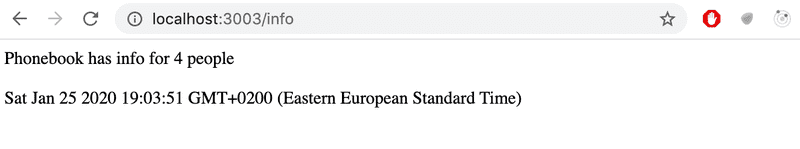

# Exercises from 3.1 to 3.6

> :bell: _You must initialize this project with the `npm init` command_

> :bell: _The application must be started with the command `npm start`._

> :bell: _The application must also offer an `npm run dev` command that will run the application and restart the server whenever changes are made and saved to a file in the source code._

## 3.1: Phonebook backend step1

Implement a Node application that returns a hardcoded list of phonebook entries from the address <http://localhost:3001/api/persons>.

Data:

``` JSON
[
    { 
      "id": 1,
      "name": "Pepe", 
      "number": "600 123 456"
    },
    { 
      "id": 2,
      "name": "Paco", 
      "number": "666 555 444"
    },
    { 
      "id": 3,
      "name": "Maria", 
      "number": "696 585 747"
    },
    { 
      "id": 4,
      "name": "Juana", 
      "number": "636 525 414"
    }
]

```

## 3.2: Phonebook backend step2

Implement a page at the address <http://localhost:3001/info> that looks roughly like this:



## 3.3: Phonebook backend step3

Implement the functionality for displaying the information for a single phonebook entry. The url for getting the data for a person with the id 5 should be <http://localhost:3001/api/persons/5>

If an entry for the given *id* is not found, the server has to respond with the appropriate status code.

## 3.4: Phonebook backend step4

Implement functionality that makes it possible to delete a single phonebook entry by making an HTTP DELETE request to the unique URL of that phonebook entry.

Test that your functionality works with either Postman or the Visual Studio Code REST client.

## 3.5: Phonebook backend step5

Expand the backend so that new phonebook entries can be added by making HTTP POST requests to the address <http://localhost:3001/api/persons>.

Generate a new id for the phonebook entry with the Math.random function. Use a big enough range for your random values so that the likelihood of creating duplicate ids is small.

## 3.6: Phonebook backend step6

Implement error handling for creating new entries. The request is not allowed to succeed, if:

* The name or number is missing
* The name already exists in the phonebook

Respond to requests like these with the appropriate status code, and also send back information that explains the reason for the error, e.g.:

``` JSON
{ error: 'name must be unique' }
```
