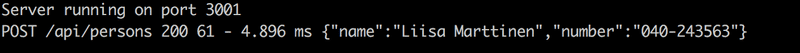

# Exercises from 3.7 to 3.8

## 3.7: Phonebook backend step7

Add the [morgan](https://github.com/expressjs/morgan) middleware to your application for logging. Configure it to log messages to your console based on the tiny configuration.

The documentation for Morgan is not the best, and you may have to spend some time figuring out how to configure it correctly. However, most documentation in the world falls under the same category, so it's good to learn to decipher and interpret cryptic documentation in any case.

Morgan is installed just like all other libraries with the `npm install` command. Taking morgan into use happens the same way as configuring any other middleware by using the `app.use` command.

## 3.8: Phonebook backend step8

Configure morgan so that it also shows the data sent in HTTP POST requests:

This exercise can be completed in a few different ways. One of the possible solutions utilizes these two techniques:

* [creating new tokens](https://github.com/expressjs/morgan#creating-new-tokens)
* [JSON.stringify](https://developer.mozilla.org/en-US/docs/Web/JavaScript/Reference/Global_Objects/JSON/stringify)
