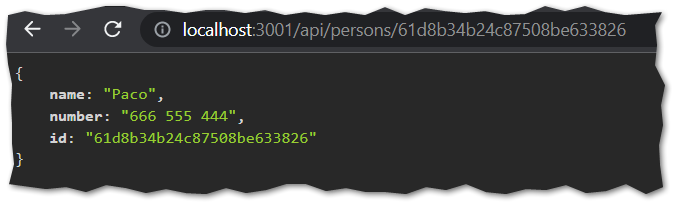

# Using mongoDB

Install Mongoose:

``` 
npm install mongoose
```

## 3.12: Command-line database

Create a cloud-based MongoDB database for the phonebook application with MongoDB Atlas.

Create a `mongo.js` file in the project directory, that can be used for adding entries to the phonebook, and for listing all of the existing entries in the phonebook.

> Do not include the password in the file that you commit and push to GitHub!

The application should work as follows. You use the program by passing three command-line arguments (the first is the password), e.g.:

```
node mongo.js yourpassword UserName UserNumber
```

As a result, the application will print:

```
added Jose number 666 555 444 to phonebook
```

> Notice that if the name contains whitespace characters, it must be enclosed in quotes

If the password is the only parameter given to the program, meaning that it is invoked like this:

```
node mongo.js yourpassword
```

Then the program should display all of the entries in the phonebook:

```
phonebook:
user1 number1
user2 number2
user3 number3
```

## 3.13: Phonebook database, step1

Change the fetching of all phonebook entries so that the data is fetched from the database.

## 3.14: Phonebook database, step2

Change the backend so that new numbers are saved to the database.

At this point, you can choose to simply allow users to create all phonebook entries. At this stage, the phonebook can have multiple entries for a person with the same name.

## 3.15: Phonebook database, step3

Change the backend so that deleting phonebook entries is reflected in the database.

## 3.16: Phonebook database, step4

Move the error handling of the application to a new error handler middleware.

## 3.17: Phonebook database, step5

If the user tries to create a new phonebook entry for a person whose name is already in the phonebook, then will try to update the phone number of the existing entry by making an `HTTP PUT `request to the entry's unique URL.

Modify the backend to support this request.

## 3.18: Phonebook database step6

Also update the handling of the api/persons/:id and info routes to use the database, and verify that they work directly with the browser, Postman, or VS Code REST client.

Inspecting an individual phonebook entry from the browser should look like this:

